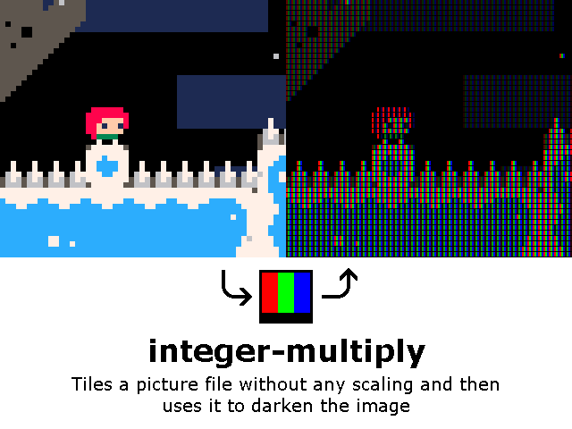
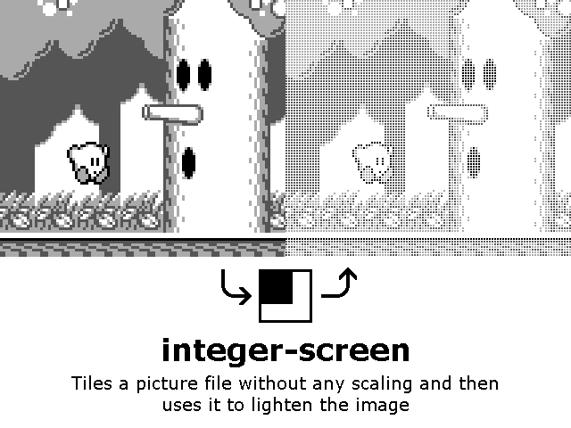
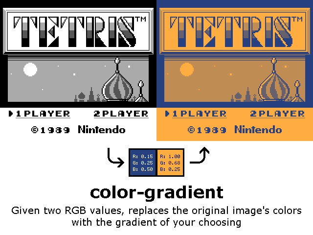
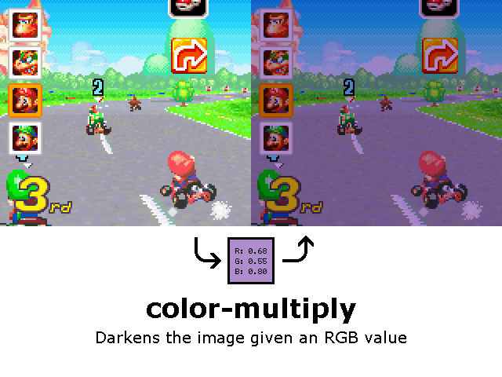
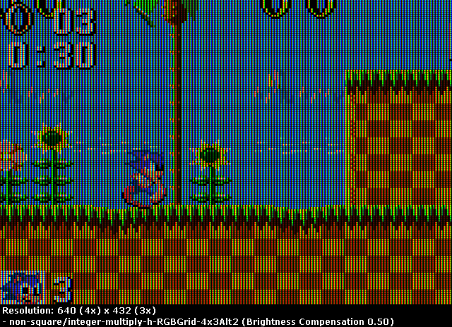
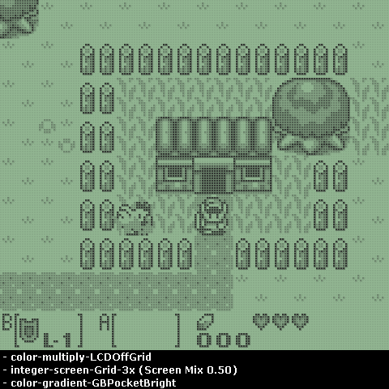
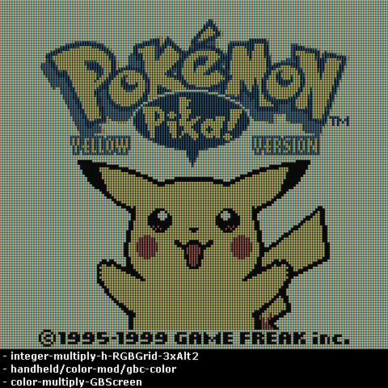

# pako-shader-pack

Welcome! This is a bundle of four lightweight shaders for Retroarch made with low power/resolution devices in mind. They can be combined with each other and other shaders (such as sharp bilinear, image adjustment, color correction, etc) with the "Append/Prepend Preset" function, if your installed RetroArch version has the option.

To install them, extract "shaders_glsl" and "shaders_slang" to RetroArch's "shaders" folder. Everything is contained within the "pako" folders.

## integer-multiply

This shader tiles a small image over the emulator output without any scaling and applies a Multiply blend mode, darkening it.

The included presets are:
- Grid: Simple black grids
- Line: Simple black horizontal lines, simulating a scanline effect
- RGBGrid: RGB pixel grids, simulating lower res LCD screens
- RGBLine: Similar to RGBGrid, but only the vertical RGB lines
- RGBSlot: Similar to RGBGrid, going for a slotmask effect instead
- RGBDiag: Diagonal RGB lines inspired by color E-Ink displays

Turn Integer Scaling ON, set the aspect ratio to 1:1 PAR and select a preset that matches the resolution scale. You can also use:
- for Line presets, any custom resolution with an integer multiple height (e.g. 2x, 3x)
- for RGBLine presets, any custom resolution with an integer multiple width

Each device may have a different LCD pixel grid. Check "screenlayoutguide.png" for a guide on which preset to use for the proper effect.

You can adjust the strength of the filter with the Multiply Mix parameter in the shader's settings.

The Brightness Compensation parameter will overexpose the image to help with the dimming.

The Swap Red-Blue parameter will swap around the red and blue values in the preset's image file (this will horizontally flip the RGB presets).

Color correction filters (for GBC, GBA etc) should ideally be applied as separate shaders on top of this one, rather than in the emulator's core options.

Motion blur shaders should be applied before these.

You can make your own presets by editing the texture path and the MultiplyLUTWidth and MultiplyLUTHeight parameters in the preset file.

This shader is modified from RetroArch's reshade/blendoverlay shader, itself based on:
https://github.com/jamieowen/glsl-blend

## integer-screen

Same as the above, only applying a Screen blend effect, thus lightening the output.

Only the Grid and Line folders are included, good for simulating LCD dot matrix displays.

## color-gradient

This shader converts the emulator's output colors into the gradient of your choosing, given two RGB values.

You can choose to base the gradient on the luminance value of the output colors or their average RGB value.

The included presets simulate the colors of the original Game Boy displays, along with several backlight options.

Apply a Grid preset from the previous two shaders underneath this one for the full LCD dot matrix effect.

## color-multiply

This shader applies a single color in Multiply blend mode over the emulator's output given one RGB value.

It's meant to be applied on top of everything else.

Included are presets that simulate GBC/GBA displays and blue light filters for reducing eyestrain.

The "LCDOffGrid" preset simulates an LCD display's off pixel grid and is to be applied under a Grid preset. If the emulator core you're using has a darkening filter setting you can use that instead.

### androidpatch

If you're using these shaders on an Android device, copy the contents to each "pako" folder to prevent the preset image folders from showing up in your gallery app (you can manually create a blank file named ".nomedia" in each folder to do this as well)

## Examples

Here's how you can combine these shaders for different effects. The shaders are listed in appending order, first to last.

